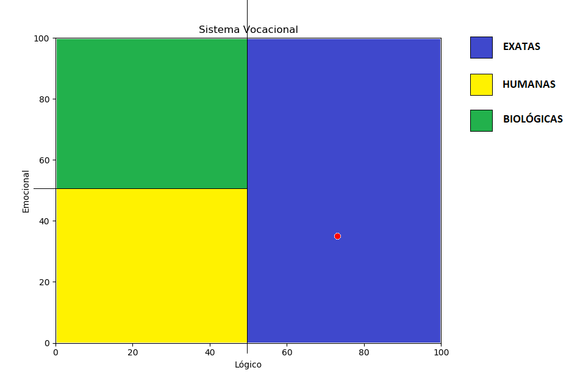
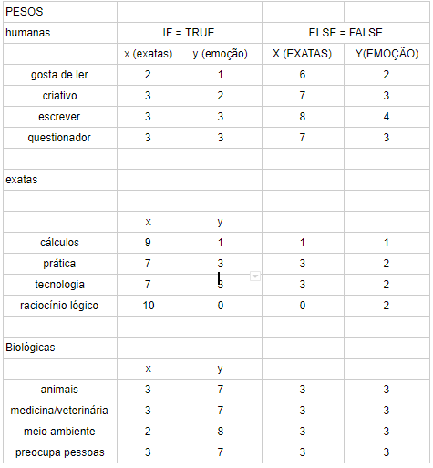

# Inteligencia Artificial.

### Objetivo
Trabalho desenvolvido para a materia de inteligencia artificial, utilizando a linguagem de programação python, juntamente com biblioteca **scikit-learn**, e tambem **pyknow** para a realização dos codigos.

**OBS: Este Projeto foi desenvolvido como um prototipo para um trabalho escolar da materia de inteligencia artificial, as questões levantadas neste trabalho, bem como as perguntas e o peso que cada uma tem, não condiz como um sistema desenvolvido por supervisão de um especialista na area, sendo assim cada questão levantada neste trabalho foi realizada por nós alunos**

## Sistema Especilaista
Sistemas especialistas, são sistemas que tem como objetivo simular o raciocínio de um profissional em alguma área de conhecimento específica. A arquitetura mais comum de um sistema especialista é a que envolve regras de produção na sua base de conhecimento. 

A base de conhecimento contém informações essenciais sobre o domínio do problema, normalmente representada por fatos de regras e produção Máquina de inferência: A máquina de inferência consiste no procedimento que infere um novo conhecimento, a partir da base de conhecimento (regras) e da informação fornecida pelo usuário.

As regras de produção de um sistema especialista, consiste em duas partes chamadas de antecedente e consequente. Sendo que as regras de produção denominadas como antecedente, são formadas por uma série de condições prévias, onde essas condições estão 	unidas por conectivos lógicos 	do tipo (E) e (OU). As regras de produção denominadas de consequente (também chamadas de conclusão), são correspondentes aos resultados das regras decorrentes do cumprimento das condições prévias. A conclusão das condições prévias são determinadas em um grau de confiança em %.

### Descrição do problema
Atualmente existem diversas profissões e opções de mercado, e o jovem é praticamente obrigado a escolher ou pelo menos traçar um objetivo até os seus 18 anos, porém a grande maioria ainda não escolheu uma profissão ou não se identificou em nenhuma área científica. Com base nessa situação, foi desenvolvido um sistema especialista, a fim de guiar os jovens a se qual área científica ele mais se enquadra.

### Regras

Antes de mais nada é preciso saber um pouco sobre a lógica usada no sistema. Foi levado em conta, o que leva uma pessoa ser da sua determinada área científica, quais características elas compartilham, para poder generalizar no sistema e classificar o indivíduo. Com base, nisso foi realizado uma tabela separando o eixo x como Lógico, e o eixo y como Emocional, de modo que a cada pergunta feita pelo programa, são setadas em uma variável os valores de x e y dela, levando em consideração a pergunta.
	Exemplo:

>Gosta de cálculos? (s / n)

Se a resposta for sim, o sistema irá atribuir os valores x (Lógico) = 9 (ou 90%) e y (Emoção) = 1 (ou 10%), tal como seu cérebro tende mais para a razão e portanto essa pessoa seria de exatas
E se a resposta for não atribui os valores de x e y = 1, e dizendo ao programa que o cérebro da pessoa não está muito para o lado lógico.

### Gráfico de resposta do sistema especialista



O grafico acima, ilustra a resposta que o usuario ira receber do sistema especialista. O grafico é dividido de acordo com as 3 categorias que os sistema aborda (humanas, exatas e biologicas), sendo assim, de acordo com as resposta do usuario e o peso das questões o sistema ira definir qual area o usuario pertence de acordo com o ponto no grafico. 

### Regras em PseudoCodigo

Logo abaixo estão definidas as regras em pseudoCodigo desenvolvidos para criar o sistema especialista:

```
SE gosta de ler
ENTÃO x = 2 e y = 1
SENÃO x = 6 e y = 2

SE sou criativo
ENTÃO x = 3 e y = 2
SENÃO x = 7 e y = 3

SE gosto de escrever
ENTÃO x = 3 e y = 3
SENÃO x = 8 e y = 4

SE sou questionador
ENTÃO x = 3 e y = 3
SENÃO x = 7 e y = 3

SE gosto de cálculo
ENTÃO x = 9 e y = 1
SENÃO x = 1 e y = 1

SE sou prático
ENTÃO x = 7 e y = 3
SENÃO x = 3 e y = 2

SE gosto de Tecnologia
ENTÃO x = 7 e y = 3
SENÃO x = 3 e y = 2

SE tenho raciocínio lógico
ENTÃO x = 10 e y = 0
SENÃO x = 0 e y = 2

SE gosto de animais
ENTÃO x = 3 e y = 7
SENÃO x = 3 e y = 3

SE gosto de veterinario ou medicina
ENTÃO x = 3 e y = 7
SENÃO x = 3 e y = 3

SE gosto do meio ambiente
ENTÃO x = 2 e y = 8
SENÃO x = 3 e y = 3

SE me preocupo com as pessoas
ENTÃO x = 3 e y = 7
SENÃO x = 3 e y = 3
```

### Tabela de pesos

A seguir, a tabela de pesos mostra o peso de cada questão e como ela ira influenciar na reposta final do usuario:



com estes pesos definidos para cada questão, o sistema consegue definir qual area a pessoa pode ter maior relacionamento de acordo com suas repostas para cada uma das perguntas.

## Árvore de descisão

Dentre os diversos algoritmos de ML, encontra-se a árvore de decisão, esta que é uma metodologia que permite extrair conhecimento presente nos dados, criada recursivamente levando em consideração algum índice de verificação. Esta é uma metodologia de computação simbólica, já que as árvores aprendem situações descritas através de sentenças lógicas. As árvores de decisão podem ser definidas como: “Uma árvore de decisão, representa a disjunção de conjunções das restrições nos valores dos atributos que descrevem a situação que está sendo aprendida”. Para que esta afirmação seja entendida, vejamos algumas características das árvores de decisão.

Para a construção de uma árvore de decisão foi levada em consideração o mesmo problema em relação ao sistema especialista. O codigo da arvore pode ser consultado neste repositorio na pasta **arvore de descisão**

## Regressão Linear

Regressão linear é o processo de traçar uma reta através dos dados em um diagrama de dispersão. Sendo assim, pode-se dizer que é o processo de traçar uma reta através dos dados em um diagrama de dispersão, em que a reta se dá pelo correlacionamentos entre as variáveis independente com a variável dependente. Para o projeto de regressão linear foi usado o mesmo tema do sistema especialista e árvore de decisão

Para a construção de uma árvore de decisão foi levada em consideração o mesmo problema em relação ao sistema especialista. O codigo da arvore pode ser consultado neste repositorio na pasta **Regressão Linear**
